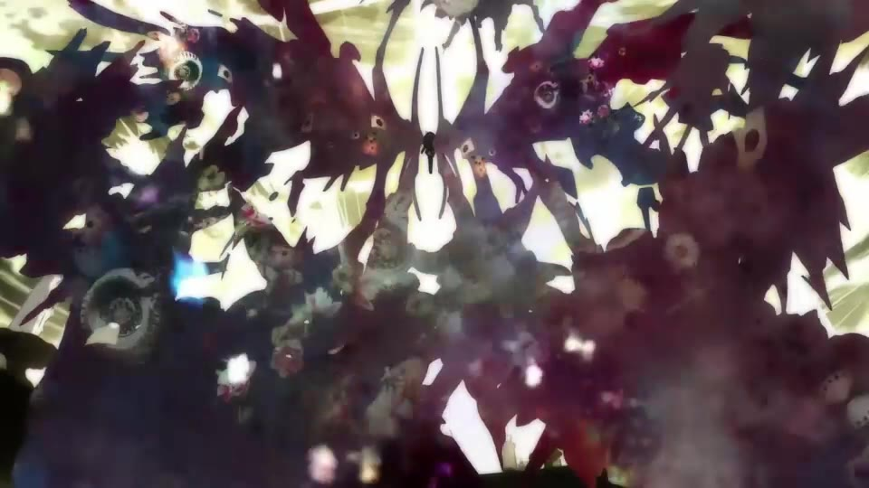

# jev剪辑 · JevCut

**让音乐带动剪辑，让决策模型挑选下一镜。**

**[▶ 在线演示：从素材库到情绪剪辑](https://chenbaiyujason.github.io/jev-cut/pitch/)** · [演示页源码](docs/pitch/index.html)

**[进入作品放映室 ↗](https://chenbaiyujason.github.io/jev-cut/pitch/#films)**：在线看两支完整成片，随播放查看原始输入、跨集镜头来源、素材入出点与真实 Jev 候选概率。沙耶香《梦的翅膀受了伤》（42 秒）呈现从牵挂、许愿到崩塌的经历；晓美焰《回马枪》（31 秒）以关系、战斗和重返守护形成回环。两支合计约 7.7 MB；段落解读是发布时整理，模型选择来自历史记录。

交互式项目介绍：空格播放／暂停，方向键切幕，`N` 查看讲稿，`F` 全屏。页面包含流程与能力示意，并非在线剪辑器；实际已实现能力以 [进展说明](docs/STATUS.md) 为准。

给一段音乐、一个主角或主题，从跨集素材中组织镜头、台词与原声，再回到完整的网页时间轴里继续编辑。JevCut 基于 FreeCut，将素材理解、语义检索和 jev 决策串在一起，支持生成剪辑、只改选中范围，以及从前到后优化镜头表现。

[操作演示](#操作演示) · [工作台功能](#工作台功能) · [效果展示](#效果展示) · [快速开始](#快速开始) · [工作原理](#工作原理)

> **开发预览版**：目前以 Windows 为主要验证环境。仓库提供源码与制作流程，素材、音乐和模型服务需自行准备；当前能力与未完成部分见 [进展说明](docs/STATUS.md)。

**最新功能**：拖入「jev匹配」占位节点完成单镜填充；广候选快速选镜；续剪规划复用；停顿后的重音重入与动作变速；原帧防重复。[查看更新说明](docs/UPDATES.md)。

## 操作演示

**从工作台操作到最终成片，约 2 分 48 秒。** 先看工程播放、延长主音轨、自动补镜、输入提示词局部换镜与导出，再看不同配乐的作品合集。

[](https://github.com/chenbaiyujason/jev-cut/releases/download/showcase-2026-09-27/freecut-demo-overview.mp4)

[▶ 观看／下载演示 MP4](https://github.com/chenbaiyujason/jev-cut/releases/download/showcase-2026-09-27/freecut-demo-overview.mp4) · 720p · 约 20 MB · [更多截图与操作说明](docs/WORKBENCH.md)

录屏为实际工作台操作，部分等待已加速；演示时长不代表模型生成耗时。展示版只压缩编码，保留原视频的操作顺序与成片内容。

## 工作台功能

左侧管理视频与音乐，中间预览，下方保留多轨时间轴，右侧 jev剪辑面板负责目标与调整。自动生成的结果仍可手动裁剪、排序和撤销。

| 延长音轨，补齐后续 | 选中镜头，用提示词修改 |
|---|---|
| [](docs/assets/demo/auto-fill.jpg) | [](docs/assets/demo/local-edit.jpg) |
| 根据主音轨的入点、长度和速度补镜。可边播边生成，等待时循环当前镜头。 | 保留全片目标，再输入本次要求。作用范围可取选中片段、入出点或游标之后。 |

- **重算全片 / 补齐后续**：从实际音轨范围出发，选择重新编排或继续往后剪。
- **换镜头 / 优化表现**：分别处理素材替换与镜头表现；支持转场、重音效果、滤镜和原声相关决策，具体可用动作受入口与安全校验限制。
- **生成进度与撤销**：查看镜头逐个排入，停止时保留已生成部分；局部修改按范围提交，可撤销。
- **原生导出**：从编辑器导出视频，也可下载项目包继续编辑。[查看导出界面](docs/WORKBENCH.md#导出与继续编辑)。

### 拖一个位置，让 jev 选这一镜

将时间轴工具栏的 **jev匹配** 拖到视频轨道空位，或点击按钮在播放头创建占位节点。拖动右边缘设置最大时长，在右侧填写可选意图，再点击“匹配并替换占位节点”。

系统结合全片目标、前后镜头、主音轨和附近重音，从完整素材库选择画面与实际裁剪窗口。结果限制在占位范围内，后续镜头的位置保持不动；面板展示选中画面、时长、耗时和决策记录。视觉复核可单独开启。

### 更多候选，减少重复计算

RAG 提供候选后，合格素材全部进入 jev 基础评分，**不再固定压成16个**。稳定的主题／乐段适配可缓存；前镜、重音、使用记录和实际源帧仍在最终选择中实时判断。

本机固定召回的局部对照中，冷评分约 **1.2–1.7秒**，同乐段连续选镜约 **0.4–0.6秒**。这些数字不含新 embedding 请求、音乐理解、浏览器显示或导出，也不是所有模型和硬件的速度保证。[候选与缓存策略](docs/SELECTION.md)。

自动编排默认着重动作时序与卡点变速；额外转场、调色和突兀缩放默认关闭。工作台仍保留手工效果能力与明确开启的表现优化入口。

## 效果展示

同一套动漫素材、同一主角 **晓美焰**，对比五段不同配乐的前半段剪辑。全部为 **16:9 · 960×540 · H.264 / AAC**，以下为轻量展示版，五段共约 **13 MB**，保留原画幅、时长与剪辑。点击封面获取 MP4（浏览器可能直接播放或下载）。

<!-- showcase:main:start -->
### 原始 M4A · 30.5 秒

[](https://github.com/chenbaiyujason/jev-cut/releases/download/showcase-2026-09-27/original-m4a.mp4)<br>**原始 M4A · 30.5 秒**<br>逆规叛道者
<!-- showcase:main:end -->

<!-- showcase:comparison:start -->
| 红色高跟鞋 | 回马枪 |
|---|---|
| [](https://github.com/chenbaiyujason/jev-cut/releases/download/showcase-2026-09-27/red-high-heels.mp4)<br>**红色高跟鞋 · 30.4 秒**<br>军械走私狂潮 | [](https://github.com/chenbaiyujason/jev-cut/releases/download/showcase-2026-09-27/huimaqiang.mp4)<br>**回马枪 · 15.5 秒**<br>破阵行 |

| 梦的翅膀受了伤 | 一笑江湖 |
|---|---|
| [](https://github.com/chenbaiyujason/jev-cut/releases/download/showcase-2026-09-27/wounded-wings.mp4)<br>**梦的翅膀受了伤 · 21.1 秒**<br>重构的节拍 | [](https://github.com/chenbaiyujason/jev-cut/releases/download/showcase-2026-09-27/yixiao-jianghu.mp4)<br>**一笑江湖 · 14.3 秒**<br>异质齿轮的狂诞步调 |
<!-- showcase:comparison:end -->

[全部 5 个视频附件](https://github.com/chenbaiyujason/jev-cut/releases/tag/showcase-2026-09-27) · [版本与视频信息](docs/showcase.json) · [展示维护指南](docs/SHOWCASE.md)

标题来自本批次的自动主题规划。示例成片与源码分别存放，媒体不属于 MIT 源码授权范围。

## 可以怎么用

| 你想做的事 | JevCut 的工作方式 |
|---|---|
| 从音乐开始做一版漫剪 | 分析音乐、规划乐句，再逐段选镜并填入时间轴 |
| 围绕一个人物或情绪选素材 | 结合跨集画面语义、字幕、原声与 embedding 检索，再交给决策模型选择 |
| 只改不满意的几秒 | 用选中片段、入出点或游标之后限定范围，输入本次修改目标 |
| 延长音乐，继续往后剪 | 按主音轨实际范围补齐后续；生成时可播放，等待时可循环当前镜头 |
| 调整整段的表现 | 从前到后检查镜头，决定转场、重音效果、滤镜和原声使用 |
| 看清模型做了什么 | 查看决策审计中的输入、候选与选择，保留取消、撤销和手工编辑能力 |

例如，输入“围绕晓美焰，帅、轮回、忧郁”，主题负责约束人物与情感方向，音乐负责提供节奏结构。无需手写每个镜头的剪辑脚本。

## 工作原理

素材准备做一次，之后的剪辑与修改复用理解结果和索引。


**大模型理解与规划，RAG 提供证据，jev 决定怎么剪。**

- **理解与规划**：多模态模型识别人物、动作、情绪、台词和原声；结合音乐形成段落计划。耗时的素材理解尽量提前缓存。
- **检索与 embedding**：从素材库找出与当前需求相关的镜头和证据。相似度帮助寻找候选，最终时间轴由后续决策形成。
- **jev 决策**：结合音乐位置、主题、候选和前后镜头，选择素材与使用方式，再决定原声、转场、重音和调色等动作。
- **编辑执行**：检查源镜头边界、转场余量、锁定片段和选区范围，再以可撤销的事务更新工作台。

默认适配 **Winnow** 的 typed-decision 协议，也可以接入其他兼容的 **jev 模型**。替换服务地址与模型路由即可连接兼容服务；仅提供聊天接口的模型需要额外适配。详见 [模型接入契约](docs/MODELS.md) 和 [完整架构](docs/ARCHITECTURE.md)。

## 快速开始

准备 Node.js 22.12+（推荐24）、Python 3.12+（本机验证3.13）、FFmpeg 和现代 Chromium 浏览器。

```sh
git clone https://github.com/chenbaiyujason/jev-cut.git
cd jev-cut
npm run setup
# 编辑 apps/backend/localdevenv/.env，配置自己的模型服务
npm run dev
```

打开 `http://127.0.0.1:8796/mad`。首次可以启动空工程；自动剪辑前，需要按 [安装与素材准备](docs/SETUP.md) 建立自己的素材索引，再导入音乐，从项目菜单进入“从音乐新建剪辑”。

交给 Agent 准备素材时，使用 [jev-mad-production Skill](skills/jev-mad-production/SKILL.md)：从取得本地视频之后，完成字幕对齐、镜头切分、压缩代理、多模态理解、索引与抽样检查。

可以直接交代 Agent：“读取 `skills/jev-mad-production/SKILL.md`，先配置环境并运行 doctor，再用我的素材清单做本地处理和理解小样本，通过后建立全库索引。”需要提供素材路径，以及自己的理解／embedding／jev 服务配置位置。完整命令与各阶段完成条件见 [执行手册](skills/jev-mad-production/references/operations.md)。

## 继续了解

| 文档 | 内容 |
|---|---|
| [工作台操作](docs/WORKBENCH.md) | 界面截图、音轨续剪、选区修改与导出 |
| [最新功能](docs/UPDATES.md) | 单镜匹配、选镜提速、规划复用与结构性重音 |
| [候选与缓存策略](docs/SELECTION.md) | RAG 与 jev 的分工、缓存边界与计时口径 |
| [安装与运行](docs/SETUP.md) | 环境、模型配置、素材流水线、首次剪辑 |
| [架构说明](docs/ARCHITECTURE.md) | 理解、检索、决策与时间轴如何配合 |
| [模型接入](docs/MODELS.md) | 替换 Winnow、接入其他 jev 模型、输入输出契约 |
| [当前进展](docs/STATUS.md) | 已实现能力、验证范围与已知限制 |
| [并行开发与发布](docs/DEVELOPMENT.md) | 继续在原目录开发，按快照同步到独立仓库 |
| [演示视频维护](docs/SHOWCASE.md) | 16:9 成片、封面、输入说明与展示位更新 |

当前仍在打磨选镜与节奏质量；纯人声分离、任意实时节奏重排尚未完整接入。模型延迟受服务、候选量和缓存影响，当前不承诺所有任务都能实时完成。

## 来源与许可

自有发布工具与整合代码采用 [MIT](LICENSE)。FreeCut、JIZURA、TransNetV2 等上游项目的来源与许可证见 [第三方说明](THIRD_PARTY_NOTICES.md)。仓库不附带动漫原片、字幕、音乐、私有索引或模型权重；媒体与模型的授权需单独处理。
