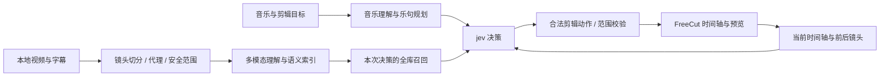

# jev剪辑 · JevCut

围绕音乐、主题和时间轴上下文，用决策模型选择动漫镜头、原声、转场、重音与调色。基于 FreeCut 工作台，保留手工编辑、选区操作、取消和撤销。

**状态：可审阅的开发预览版。当前仓库先私有准备，尚未作为稳定公开版本发布。** 不附带动漫原片、字幕、歌曲、成片、私有语义索引或模型权重。需要使用自己的素材和模型服务。

## 原理



- **多模态模型**负责理解画面、人物、动作、情绪、字幕含义与原声；再理解音乐、规划乐句。重工作尽量离线缓存。
- **检索与 embedding**提供本次决策需要的相关材料，不直接决定最终时间轴。
- **决策模型**结合目标、音乐段落、已经选择的前文、后续上下文和候选证据，决定怎么使用素材。默认适配 Winnow 的 typed-decision 协议，也可连接其他兼容 jev 模型。
- **编译与执行层**限制合法动作、检查源帧余量和选区边界，以事务更新 FreeCut。模型不能直接执行任意代码。

完整说明：[架构](docs/ARCHITECTURE.md) · [当前进展](docs/STATUS.md) · [模型替换](docs/MODELS.md)。

## 快速开始

需要 Node.js 22+、Python 3.11+、FFmpeg，以及用于预览的现代 Chromium。Windows 是当前主要开发环境，其他平台的路径适配已准备，尚未做完整硬件端到端验收。

```sh
npm run setup
# 编辑 apps/backend/localdevenv/.env，配置自己的模型服务
npm run dev
```

打开 `http://127.0.0.1:8796/mad`。首次可启动空工程；实际自动选镜需要先准备素材索引。当前开发目录的服务若正在占用端口，使用独立端口启动此仓库，详见 [安装与运行](docs/SETUP.md)。

## 从已有视频准备素材

项目内提供 [jev-mad-production Skill](skills/jev-mad-production/SKILL.md)，覆盖下载完成后的本地视频、字幕对齐、TransNetV2 切分、压缩代理、Gemini 理解、embedding、安全范围与生成验证。

```sh
# 先安装 Python 依赖与镜头模型，见 SETUP.md
# 将 examples/sources.example.json 复制为 data/sources.json，改成自己的文件
npm run media -- --manifest data/sources.json --stage local
npm run media -- --stage understand
npm run media -- --stage embedding
npm run media -- --stage index
```

字幕和原声是选镜证据的一部分；原声轨仍可能混有原配乐。纯人声分离、任意实时节奏重排尚未作为已完成能力提供。

## 模型可以更换

在忽略的配置文件中设置 `JEV_DECISION_URL`；对支持模型路由的服务，可另设 `JEV_MODEL`。兼容服务需要接受 `/v1/systemone` 的问题/候选结构，并返回合法的 `answers`。只有聊天接口的模型需要额外适配，不能仅改模型名就假定兼容。

图片支持、评分范围、条件概率和延迟的区别见 [模型接入契约](docs/MODELS.md)。真实模型 ID 会保留在审计数据里，不伪装模型来源。

## 继续在原目录开发

此仓库是**独立发布副本**，不替代原开发目录。开发现场更新后执行一次快照同步：

```sh
python tools/sync-workspace.py --backend /path/to/live/backend --editor /path/to/live/editor
npm run sync       # 应用快照；不会修改源目录
npm run audit
```

源路径只保存在被忽略的 `.sync/local.json`。默认不推送，不自动提交，不锁住源目录；双边修改会报告冲突。详见 [并行开发与发布](docs/DEVELOPMENT.md)。

## 仓库结构

| 路径 | 内容 |
|---|---|
| `apps/editor` | 带 jev剪辑入口的 FreeCut 编辑器与原生合成服务 |
| `apps/backend` | 素材、理解、检索、决策、选区事务与 API |
| `skills/jev-mad-production` | 从本地视频到可剪辑素材的 Agent Skill |
| `tools` | 发布同步、模型下载、启动与审计工具 |
| `docs` | 架构、当前状态、安装、模型契约与维护方式 |
| `release-manifest.json` | 导出文件的来源与哈希，不含本机绝对路径 |

## 验证

```sh
npm test
npm run test:sync
npm run test:backend
npm run build:editor
npm run audit
```

这些检查不等于审美评分，也不代表所有模型和硬件上的速度保证。真实素材的完整观看、音频听辨和范围外帧对照仍需在自己的素材上做。

## 来源与许可

自有发布工具与整合代码采用 MIT；FreeCut、JIZURA 和 TransNetV2 的原始许可证保留在对应目录。见 [THIRD_PARTY_NOTICES.md](THIRD_PARTY_NOTICES.md)。媒体和模型权重不包含在源码授权中。
