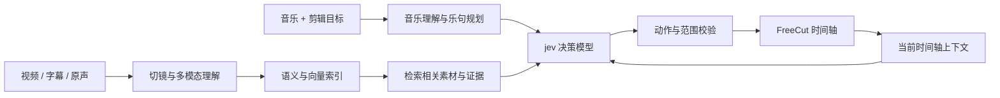

# jev剪辑 · JevCut

**让音乐带动剪辑，让决策模型挑选下一镜。**

给一段音乐、一个主角或主题，从跨集素材中组织镜头、台词与原声，再回到完整的网页时间轴里继续编辑。JevCut 基于 FreeCut，将素材理解、语义检索和 jev 决策串在一起，支持生成剪辑、只改选中范围，以及从前到后优化镜头表现。

[效果展示](#效果展示) · [快速开始](#快速开始) · [工作原理](#工作原理) · [素材准备 Skill](skills/jev-mad-production/SKILL.md) · [接入其他模型](docs/MODELS.md)

> **开发预览版**：目前以 Windows 为主要验证环境。仓库提供源码与制作流程，素材、音乐和模型服务需自行准备；当前能力与未完成部分见 [进展说明](docs/STATUS.md)。

## 效果展示

以下位置将放入真实的 **16:9 成片**，目前视频待补充。

### 01 · 跟着音乐剪出情绪

跨集选镜，将人物、动作与情绪组织进音乐段落，观察重音落点、镜头疏密，以及台词和原声的使用。

<!-- showcase:main:start -->
> 🎬 成片待上传 · 16:9
<!-- showcase:main:end -->

### 02 · 换一首音乐，换一种表达

用同一套素材，对比不同音乐或剪辑目标下的选镜、顺序与节奏。每段视频会附上实际输入和版本信息，方便对应效果。

<!-- showcase:comparison:start -->
> 🎬 对比成片待上传 · 16:9
<!-- showcase:comparison:end -->

后续视频接入方式见 [演示视频维护指南](docs/SHOWCASE.md)。

## 可以怎么用

| 你想做的事 | JevCut 的工作方式 |
|---|---|
| 从音乐开始做一版漫剪 | 分析音乐、规划乐句，再逐段选镜并填入时间轴 |
| 围绕一个人物或情绪选素材 | 结合跨集画面语义、字幕、原声与 embedding 检索，再交给决策模型选择 |
| 只改不满意的几秒 | 用选中片段、入出点或游标之后限定范围，输入本次修改目标 |
| 调整整段的表现 | 从前到后检查镜头，决定转场、重音效果、滤镜和原声使用 |
| 看清模型做了什么 | 查看决策审计中的输入、候选与选择，保留取消、撤销和手工编辑能力 |

例如，输入“围绕晓美焰，帅、轮回、忧郁”，主题负责约束人物与情感方向，音乐负责提供节奏结构。无需手写每个镜头的剪辑脚本。

## 工作原理

素材准备做一次，之后的剪辑与修改复用理解结果和索引。



**大模型理解与规划，RAG 提供证据，jev 决定怎么剪。**

- **理解与规划**：多模态模型识别人物、动作、情绪、台词和原声；结合音乐形成段落计划。耗时的素材理解尽量提前缓存。
- **检索与 embedding**：从素材库找出与当前需求相关的镜头和证据。相似度帮助寻找候选，最终时间轴由后续决策形成。
- **jev 决策**：结合音乐位置、主题、候选和前后镜头，选择素材与使用方式，再决定原声、转场、重音和调色等动作。
- **编辑执行**：检查源镜头边界、转场余量、锁定片段和选区范围，再以可撤销的事务更新工作台。

默认适配 **Winnow** 的 typed-decision 协议，也可以接入其他兼容的 **jev 模型**。替换服务地址与模型路由即可连接兼容服务；仅提供聊天接口的模型需要额外适配。详见 [模型接入契约](docs/MODELS.md) 和 [完整架构](docs/ARCHITECTURE.md)。

## 快速开始

准备 Node.js 22+、Python 3.11+、FFmpeg 和现代 Chromium 浏览器。

```sh
git clone https://github.com/chenbaiyujason/jev-cut.git
cd jev-cut
npm run setup
# 编辑 apps/backend/localdevenv/.env，配置自己的模型服务
npm run dev
```

打开 `http://127.0.0.1:8796/mad`。首次可以启动空工程；自动剪辑前，需要按 [安装与素材准备](docs/SETUP.md) 建立自己的素材索引，再导入音乐，从项目菜单进入“从音乐新建剪辑”。

交给 Agent 准备素材时，使用 [jev-mad-production Skill](skills/jev-mad-production/SKILL.md)：从取得本地视频之后，完成字幕对齐、镜头切分、压缩代理、多模态理解、索引与抽样检查。

## 继续了解

| 文档 | 内容 |
|---|---|
| [安装与运行](docs/SETUP.md) | 环境、模型配置、素材流水线、首次剪辑 |
| [架构说明](docs/ARCHITECTURE.md) | 理解、检索、决策与时间轴如何配合 |
| [模型接入](docs/MODELS.md) | 替换 Winnow、接入其他 jev 模型、输入输出契约 |
| [当前进展](docs/STATUS.md) | 已实现能力、验证范围与已知限制 |
| [并行开发与发布](docs/DEVELOPMENT.md) | 继续在原目录开发，按快照同步到独立仓库 |
| [演示视频维护](docs/SHOWCASE.md) | 16:9 成片、封面、输入说明与展示位更新 |

当前仍在打磨选镜与节奏质量；纯人声分离、任意实时节奏重排尚未完整接入。模型延迟受服务、候选量和缓存影响，当前不承诺所有任务都能实时完成。

## 来源与许可

自有发布工具与整合代码采用 [MIT](LICENSE)。FreeCut、JIZURA、TransNetV2 等上游项目的来源与许可证见 [第三方说明](THIRD_PARTY_NOTICES.md)。仓库不附带动漫原片、字幕、音乐、私有索引或模型权重；媒体与模型的授权需单独处理。
