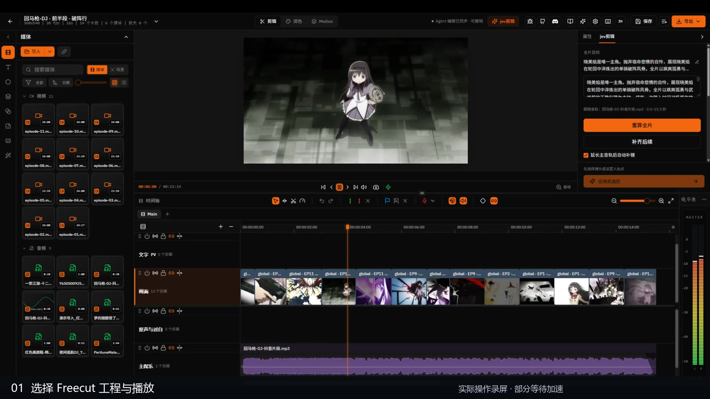
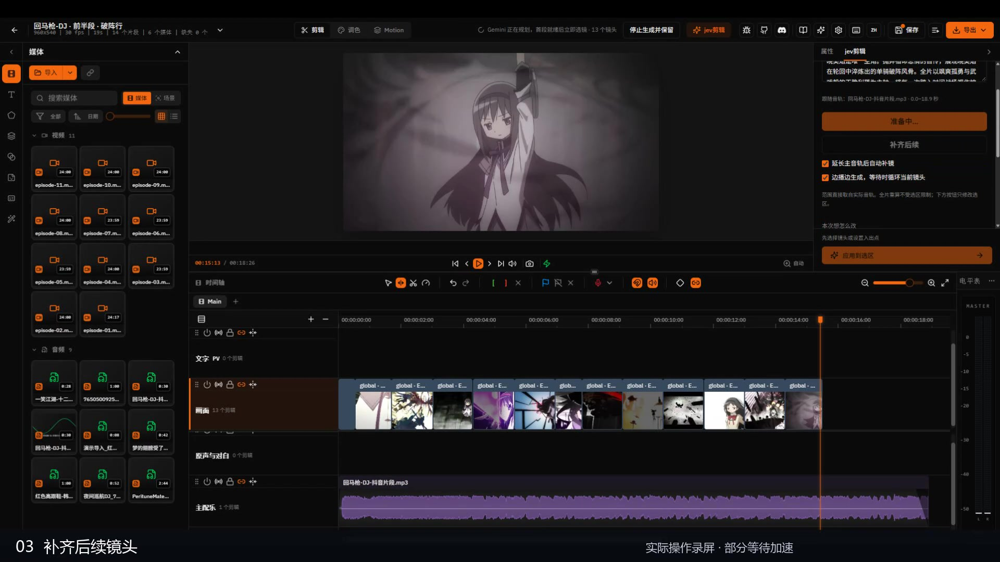
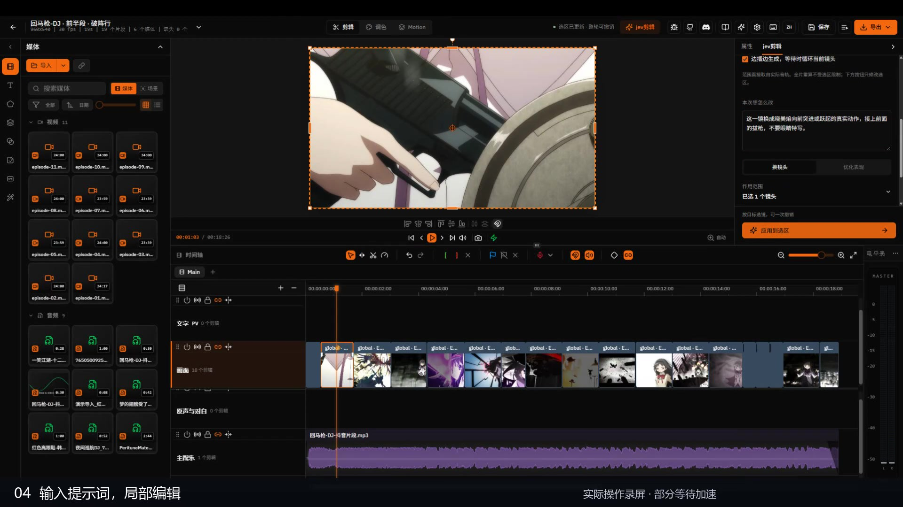
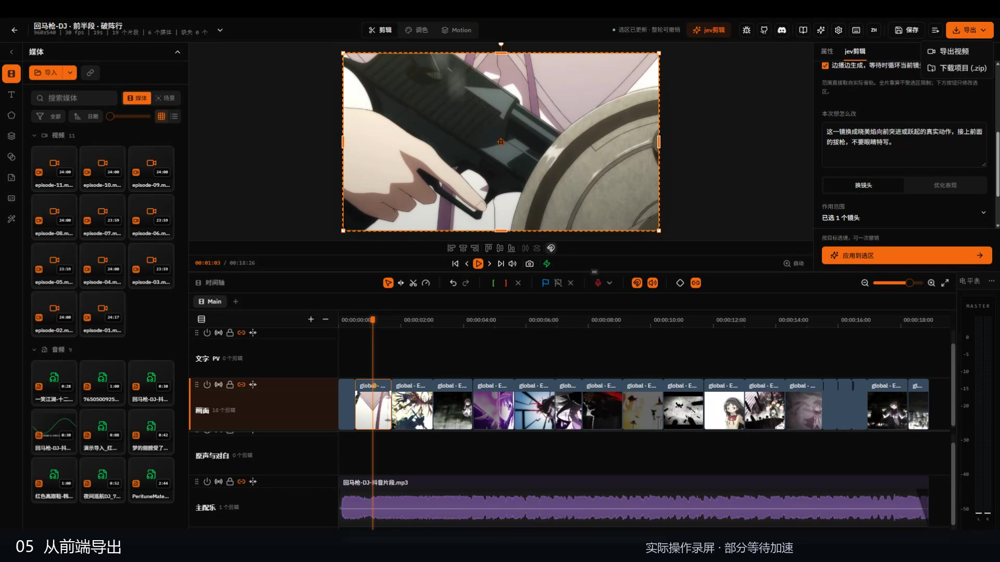

# 工作台操作

[观看演示与成片合集](https://github.com/chenbaiyujason/jev-cut/releases/download/showcase-2026-09-27/freecut-demo-overview.mp4) · 约 2 分 48 秒 · 720p · 约 20 MB

以下截图直接截自演示视频，保留原始 1080p 画幅，点击可查看大图。录屏中的部分等待经过加速，不能据此估计真实生成耗时。

## 一个工作台完成自动剪辑与手工调整

左侧素材库管理原片与配乐，中间预览当前画面，下方时间轴分别放置画面、原声与对白、主配乐等轨道。右侧 jev剪辑面板与属性面板共用检查器空间。

全片目标定义人物与情绪方向，音乐提供节奏依据。已有工程可直接播放并继续修改；自动选镜之后仍能使用编辑器手动裁剪、排序和调整属性。

## 延长主音轨，补齐后续

“补齐后续”使用主音轨的实际时间范围；“重算全片”重新编排音轨覆盖区域。音频的源入点、在时间轴上的位置、长度和播放速度都会影响生成范围。

开启“延长主音轨后自动补镜”，拖长音乐后即可触发后续生成。开启“边播边生成”，等待下一镜时可以循环当前镜头；这个循环只服务预览，不写入最终导出时间轴。停止生成会保留已排入的真实镜头。

## 用自然语言修改选中范围

1. 选中需要调整的镜头，或设置入点、出点。
2. 在“本次想怎么改”中写具体要求，例如“换成向前突进的真实动作，接住前面的拔枪，不要眼睛特写”。
3. 选择“换镜头”或“优化表现”，确认面板显示的作用范围，再应用。

全片目标持续约束人物与情感，本次指令表达局部修改意图。决策模型结合当前音乐位置、邻接镜头和素材证据选择动作；执行层检查选区、锁定和源帧边界。局部应用可撤销；“重算全片”是单独入口，不受局部选区限制。

表现优化可涉及转场、重音效果、滤镜与原声使用。不同入口启用的能力不同，纯人声分离尚未接入；已有原声可能包含原配乐。当前接入范围见 [进展说明](STATUS.md)。

## 导出与继续编辑

右上角导出菜单提供视频导出和项目包下载。视频用于观看和分享，项目包用于继续编辑；两者不是同一种交付物。实际导出期间保持页面打开，完成后检查播放与声音。

这段演示先展示工作台操作与本次导出，再拼接五段不同配乐的作品。单独的五段视频仍可在 [README 效果展示](../README.md#效果展示) 中分别获取。
